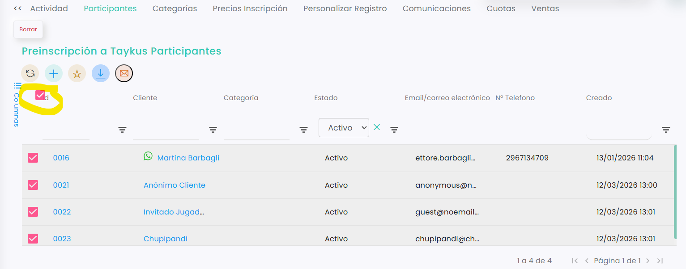

# Gestionar participantes en preinscripciones

La sección **Participantes** permite consultar y gestionar todas las personas inscritas en una preinscripción. Desde aquí es posible revisar la información de cada inscripción, añadir anotaciones manuales o exportar el listado completo de participantes.

Esto facilita al club tener un control claro de los asistentes y disponer de la información recopilada durante el proceso de inscripción.



### Acceder a la sección Participantes

* Dirígete al menú de la izquierda y accede a **Academia**.
* Clica en **Preinscripciones**.
* Selecciona sobre el id de la preinscripción que deseas gestionar.
* En la parte superior, haz clic en la pestaña **Participantes**.




### Consultar y gestionar los participantes

En esta sección podrás visualizar el listado completo de personas inscritas en la actividad.

Desde aquí podrás:

* Revisar la información de cada participante.
* Consultar los datos recogidos en el formulario de inscripción.
* Añadir **comentarios o anotaciones manuales** si necesitas registrar información adicional.

Esto permite mantener toda la información relacionada con los participantes organizada en un único lugar.



### Exportar el listado de participantes

Si necesitas trabajar con la información fuera del sistema, puedes exportar el listado de participantes.

*   Clica sobre Id para seleccionar a todos los participantes. 

    <figure><figcaption></figcaption></figure>
*   Selecciona en exportar y elige el formato de descarga. 

    <figure><figcaption></figcaption></figure>
* Hecho esto, comenzará la descarga y podrás localizar el archivo su carpeta de descargas.



De esta manera, el club puede consultar y gestionar fácilmente todas las inscripciones realizadas en la preinscripción para la academia. La sección de participantes, centraliza la información recopilada durante el registro, permitiendo además exportarla para su revisión o tratamiento externo cuando sea necesario.
