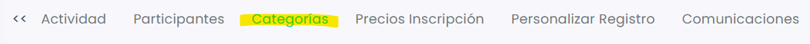

# Cómo crear categorias

Las **categorías** permiten organizar a los participantes dentro de una actividad según distintos criterios, como por ejemplo modalidad, nivel o tipo de competición.

Esto resulta especialmente útil en actividades como torneos o eventos donde los jugadores pueden inscribirse en diferentes categorías (por ejemplo: masculino, femenino, mixto o distintos niveles de juego).

En este artículo te explicamos cómo crearlas.



### Acceder a la sección Categorías

* Dirígete al menú de la izquierda y accede a **Actividades**.
* Selecciona sobre el id de la actividad que deseas gestionar.
*   En la parte superior, haz clic en la pestaña **Categorías**. 

    <figure><figcaption></figcaption></figure>



### Crear una nueva categoría

* Clica en :heavy\_plus\_sign:.
*   Se abrirá una ventana donde deberás completar el siguiente campo: 

    <figure><figcaption></figcaption></figure>

    * **Nombre:** Indica el nombre de la categoría (por ejemplo: Masculino, Femenino, Mixto o distintos niveles de juego).
* Una vez indicado el nombre, clica en **Guardar** para crear la categoría.



### Añadir más categorías

Puedes repetir este proceso tantas veces como sea necesario para crear todas las categorías que formarán parte de la actividad.

Estas categorías serán utilizadas posteriormente para **gestionar las inscripciones de los participantes** y para **configurar los precios de inscripción según el número de categorías**.



Una vez creadas las categorías, los participantes podrán seleccionarlas durante el proceso de inscripción y el sistema gestionará automáticamente su registro dentro de la actividad.
