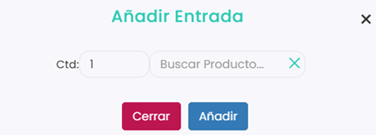

# Cómo hacer una entrada manual de Stock

En este artículo, te mostramos cómo realizar una entrada manual de stock. Existen dos
\
formas de añadir inventario a tus productos.

La primera opción consiste en acceder al listado de peticiones de stock, ingresar al
\
bloque de entrada y agregar las nuevas cantidades para cada artículo. Este método
\
es ideal para actualizar varios productos al mismo tiempo de forma rápida y sencilla.

Para saber cómo, léase el siguiente artículo:\
[como-crear-una-peticion-de-stock.md](como-crear-una-peticion-de-stock.md "mention")


Sin embargo, si solo necesitas añadir stock a un único artículo, lo más conveniente es
\
optar por la segunda opción, pensada específicamente para gestionar entradas
\
individuales.

Para ellos, solo hay que seguir estos sencillos pasos:



### Acceso a Entrada Manual

* Dirígete a la columna de la izquierda y selecciona Almacén.
* En el desplegable, clica en Entrada Manual.



### Añade entrada

* Selecciona, en la esquina superior izquierda, Añadir Entrada.
*   Se abrirá el siguiente formulario que deberás completar de la siguiente manera: 

    
<figure><figcaption></figcaption></figure>

    * **Ctd:** Es la cantidad que queremos añadir.
    * **Buscar Producto:** Al seleccionar, se abre un listado de todos los productos que tienen control de Stock.
* Clica en Añadir para guardar los cambios.



Tras completar la entrada, el sistema reflejará inmediatamente las nuevas cantidades en el inventario.\
Recuerda revisar el listado de artículos para comprobar que el stock se ha actualizado correctamente.
