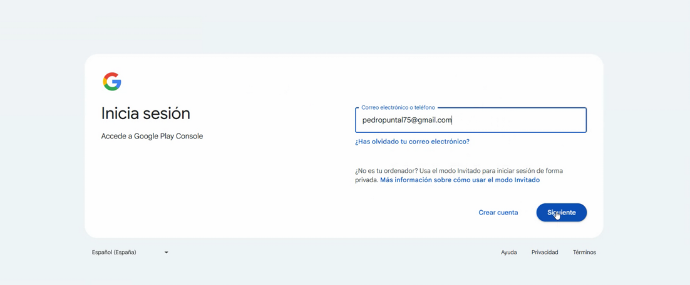

# Cómo crear una cuenta de desarrollador

Para poder publicar una aplicación propia en Google Play, es necesario disponer de una cuenta de desarrollador en **Google Play Console**.

Esta cuenta debe estar asociada a la empresa, club o entidad responsable de la aplicación, ya que Google solicitará información para verificar la organización y poder completar el proceso de registro correctamente.

En este artículo veremos cómo crear una cuenta de desarrollador para Android y qué información será necesario tener preparada antes de finalizar el alta.

***

### Antes de empezar

Antes de iniciar el registro, recomendamos tener preparada la siguiente información:

* Una cuenta de Gmail asociada a la empresa, club o a uno de sus responsables.
* Número **D-U-N-S** de la empresa o entidad.
* Teléfono y correo electrónico de contacto.
* Sitio web oficial del club o entidad.
* Datos de facturación.
* Método de pago para abonar la tarifa de registro.
* Nombre de desarrollador que se mostrará públicamente en Google Play.

Es importante utilizar datos actualizados y revisados con frecuencia, ya que Google puede utilizarlos para verificar la cuenta o enviar comunicaciones importantes.

***



### Acceso al registro

* Accede al siguiente enlace:\
  <a href="https://play.google.com/console/u/0/signup." class="button primary">Acceso a Google Play Console</a>
*   Una vez ahí, inicia sesión utilizando una cuenta de
    &#x20;Gmail que pertenezca a la empresa o a uno de los
    &#x20;directores del club. 

    <figure><figcaption></figcaption></figure>



### Seleccionar el tipo de cuenta de organización

* En la pantalla de inicio del registro, selecciona la opción **Una empresa o un negocio** como tipo de cuenta.
*   Hax clic en el botón **Empezar** para iniciar el proceso de configuración de la cuenta. 

    <figure><figcaption></figcaption></figure>



### Información necesaria para crear la cuenta

* Google mostrará un resumen con la información que será necesaria para continuar con el alta.
* Entre los datos que puede solicitar se encuentran:
  * Número **D-U-N-S** de la empresa.
  * Teléfono o correo electrónico de contacto.
  *   Método de pago para abonar la tarifa de registro. 

      <figure><figcaption></figcaption></figure>

#### Número D-U-N-S

* El número **D-U-N-S** es un identificador único de empresa que Google puede solicitar para verificar la organización.
* Si la empresa o entidad aún no dispone de este número, será necesario solicitarlo antes de continuar con la configuración de la cuenta, haciendo clic en el siguiente botón:\
  <a href="https://cloud.email.informa.es/numero-duns" class="button primary">Solicitar número D-U-N-S</a>
* Existen dos opciones disponibles:
  * **Solicitud preferente:** obtendrás el número de
    &#x20;forma inmediata abonando un coste de 9 € + IVA.
  * **Solicitud gratuita:** no tiene coste, pero el número
    &#x20;tardará entre 10 y 14 días en ser emitido.

<figure><figcaption></figcaption></figure>



### Indicar el nombre del desarrollador

* A continuación, deberás introducir el **nombre del desarrollador** que quieres asociar a la cuenta.
*   Este nombre será visible públicamente en Google Play como responsable de las aplicaciones publicadas, por lo que debe representar correctamente a la empresa, club o entidad. 

    <figure><figcaption></figcaption></figure>



### Crear el perfil de pagos

*   Durante el proceso de registro, Google solicitará crear o vincular un **perfil de pagos**. 

    <figure><figcaption></figcaption></figure>
* Este perfil es necesario para verificar la identidad de la organización y gestionar la información de facturación asociada a la cuenta.
* Deberás completar los datos solicitados, como la información fiscal o de facturación de la empresa o entidad.\
  .png>)



### Información de la organización

*   En este apartado, Google solicitará información adicional sobre la organización.

    Algunos de los datos que pueden solicitarse son:

    * Tamaño de la organización.
    * Teléfono de contacto.
    * Sitio web oficial.
*   Es importante que los datos introducidos coincidan con la información oficial de la empresa o entidad para evitar errores durante la verificación. 

    <figure><figcaption></figcaption></figure>



### Información sobre el desarrollador

*   Google también puede solicitar información relacionada con la persona o entidad que gestionará la cuenta de desarrollador. 

    <figure><figcaption></figcaption></figure>
* En este apartado se puede solicitar información sobre:
  * Experiencia previa en el desarrollo o publicación de aplicaciones.
  * Web de la empresa o entidad.
  * Perfil profesional o información adicional vinculada al desarrollador.

<figure><figcaption></figcaption></figure>



### Información sobre las aplicaciones

*   En este paso deberás indicar información sobre las aplicaciones que se van a publicar en Google Play. 

    <figure><figcaption></figcaption></figure>
*   Google puede solicitar datos como:

    * Tipo de aplicaciones que se van a desarrollar.
    * Finalidad principal de la aplicación.
    * Categoría de la aplicación.
    * Si se prevé obtener ingresos mediante la app.
    * Si habrá compras integradas, publicidad u otros métodos de monetización.

    <figure><figcaption></figcaption></figure>
* Para una app propia del club, puede indicarse que se trata de una aplicación de servicios o gestión deportiva, orientada a los usuarios del club.



### Información de contacto para Google

*   Antes de finalizar, deberás completar los datos de contacto que Google utilizará para comunicarse con la empresa o entidad. 

    <figure><figcaption></figcaption></figure>
*   Estos datos deben estar actualizados y ser revisados con frecuencia, ya que Google puede utilizarlos para enviar avisos importantes relacionados con la cuenta, la verificación o las aplicaciones publicadas. 

    <figure><figcaption></figcaption></figure>



### Aceptar términos y realizar el pago

* Para finalizar el proceso de registro, deberás revisar y aceptar los términos y condiciones de Google Play Console.
* Después, será necesario realizar el pago único de registro, que tiene un coste de 25 USD, de la cuenta de desarrollador.
*   Una vez aceptadas las condiciones y completado el pago, Google continuará con el proceso de alta y verificación de la cuenta. 

    <figure><figcaption></figcaption></figure>



Una vez completado el registro, la empresa o entidad dispondrá de una cuenta de desarrollador en Google Play Console.

Desde esta cuenta se podrán gestionar las aplicaciones Android asociadas al club, revisar la información del perfil de desarrollador y completar los pasos necesarios para que la app pueda publicarse en Google Play.

Es importante conservar el acceso a la cuenta utilizada durante el registro y revisar periódicamente las comunicaciones de Google para evitar bloqueos, retrasos o incidencias durante el proceso de publicación.
