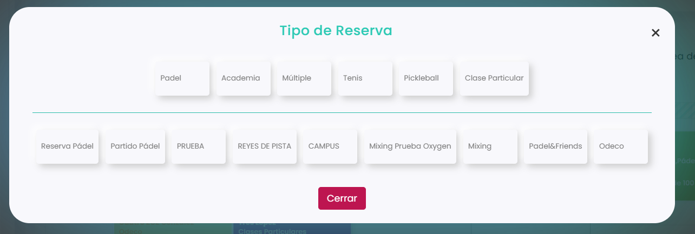

# Cómo crear una reserva múltiple

La **reserva múltiple** crea varias reservas a la vez. Es muy útil cuando un jugador quiere una pista fija durante un periodo (por ejemplo, todos los martes) o cuando el club necesita bloquear varias pistas para torneos, clases o eventos.

En una misma reserva múltiple puedes elegir varios **recursos**, **fechas**, **días** y **horarios**.

### Vídeo explicativo



A continuación, se detallan los pasos a seguir:



### Acceso a la pestaña Múltiple

* Dirígete al menú lateral izquierdo y selecciona **Calendario**.
* Clica sobre el **día**, la **pista** y la **hora** en la que quieres empezar la reserva.
*   Elige el **tipo de reserva**. 

    <figure><figcaption></figcaption></figure>
* Abre la pestaña **Múltiple**.

<figure><figcaption></figcaption></figure>

En esta pestaña configurarás los recursos, la duración y los horarios de la reserva múltiple.

<figure><figcaption></figcaption></figure>



### Seleccionar los recursos

* Pulsa el botón :heavy\_plus\_sign:\
  .png>)
* Se abrirá una ventana para elegir las pistas o instalaciones que quieres reservar.

<figure><figcaption></figcaption></figure>

* Marca los recursos y pulsa **OK**.



### Indicar fechas y descripción

* **Fecha de inicio:** día en el que empieza la reserva múltiple.
* **Fecha de fin:** último día en el que se repite la reserva.
* **Descripción:** un nombre para reconocer la reserva múltiple.

<figure><figcaption></figcaption></figure>



### Seleccionar días y horarios

* Elige la **hora** de la reserva.
* Pulsa el botón **+** para añadir esa franja horaria.
*   Marca los **días de la semana** en los que se repetirá. 

    <figure><figcaption></figcaption></figure>
* Repite el proceso si necesitas otros días u horarios.

> **Importante:** después de elegir la hora, tienes que pulsar el botón **+**. Si no añades la franja con este botón, aunque marques los días, el sistema no dejará guardar la reserva múltiple.



### Comprobar la disponibilidad

*   Antes de guardar, pulsa para comprobar la disponibilidad. 

    <figure><figcaption></figcaption></figure>
* Así verás si los recursos están libres en las fechas y horarios elegidos.
* Los que no estén disponibles aparecerán marcados en rojo.\
  .png>)



### Guardar la reserva múltiple

* Cuando hayas revisado la disponibilidad, guarda la reserva múltiple.
* El sistema creará todas las reservas según los recursos, días y horarios configurados.
* Si alguna no se puede crear por falta de disponibilidad, revisa los recursos marcados en rojo y cambia la selección.



Una vez guardada, verás todas las reservas en el calendario y podrás consultarlas y gestionarlas cuando lo necesites.
