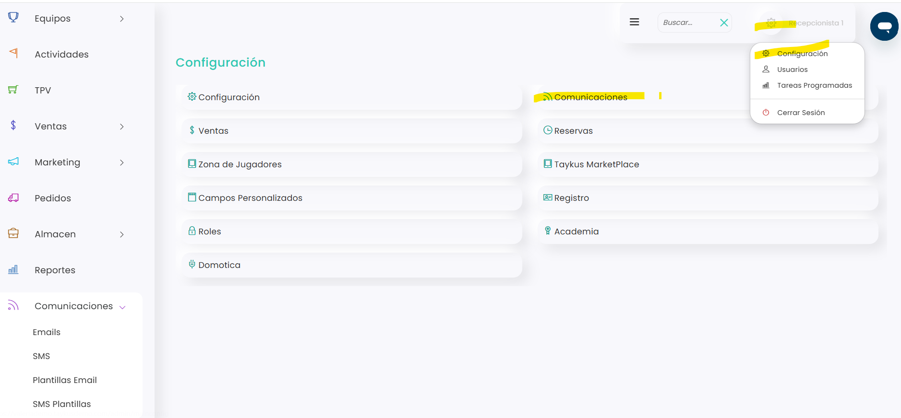

# Acceso a la configuración de las comunicaciones

Desde el apartado de **Comunicaciones** puedes gestionar la configuración relacionada con los mensajes y correos enviados desde Taykus.

En este artículo te mostramos cómo acceder a esta sección para revisar o modificar sus opciones.



### Acceso a comunicaciones

* Dirígete al menú de configuración situado en la esquina superior derecha.
*   Clica en comunicaciones 

    <figure><figcaption></figcaption></figure>



Una vez completados estos pasos, accederás al apartado de **Comunicaciones**, desde donde podrás consultar y gestionar las diferentes opciones de configuración.
