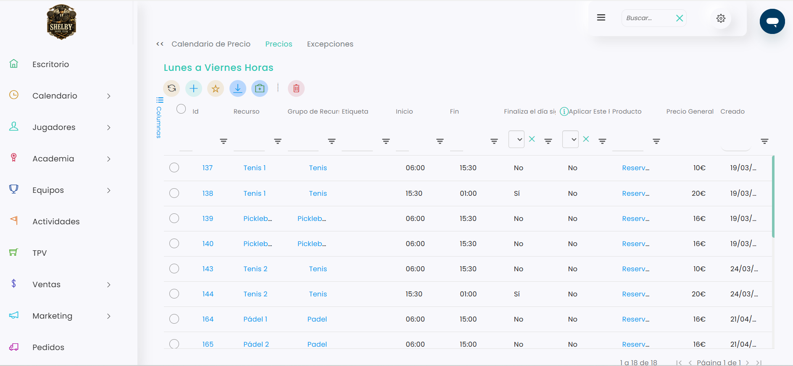

# Cómo modificar los precios

En este artículo vamos a ver cómo modificar los precios que se aplican a las reservas dentro de Taykus.

Los precios de las reservas están vinculados a los horarios configurados en el sistema, por lo que, antes de realizar cualquier cambio, es importante revisar que estamos editando el horario correcto, las instalaciones correspondientes y las franjas horarias adecuadas.

### Video Explicativo



En el siguiente artículo te mostramos paso a paso cómo acceder a la configuración de horarios y modificar los precios de las reservas.

### Pasos previos

Antes de modificar los precios de las diferentes franjas horarias desde el apartado _Precios por calendario_, es necesario que el nuevo precio ya esté creado en el sistema.

Si quieres consultar cómo crear un nuevo precio, haz clic en el siguiente botón:

<a href="../../ventas/productos/como-crear-un-producto-tipo-servicio.md" class="button primary" data-icon="box">Cómo crear un producto tipo Servicio</a>



### Acceso a Precios por Calendario

* Dirígete a la esquina superior derecha y clica en el icono de **Configuración**.
* En el desplegable que se abre, selecciona **configuración**.&#x20;
*   Luego accede a **Reservas**.

    
<figure><figcaption></figcaption></figure>

*   Localiza el bloque **Precios por Calendario** y haz clic. 

    <figure><figcaption></figcaption></figure>



### Seleccionar el calendario de precios

* Localiza el horario sobre el que se quiere hacer el cambio.
* Selección el id del horario en cuestión.
*   Dirígete al bloque de Precios.

    
<figure><figcaption></figcaption></figure>




### Editar las líneas de precio existentes

Dentro del horario, encontraremos las franjas configuradas con sus precios correspondientes.

Dentro de la pestaña **Precios**, se mostrará un listado con las franjas horarias configuradas.

<figure><figcaption></figcaption></figure>

* Localiza la columna de **Productos** y hazla mas larga hacia la derecha.
*   Clica sobre el espacio en blanco señalado. 

    <figure><figcaption></figcaption></figure>
*   Selecciona la X para quitar el producto actual. 

    
<figure><figcaption></figcaption></figure>

* Busca el nuevo producto, correspondiente al nuevo precio.\
  .png>)
* Selecciona el deseado y pulsa enter.
* Esa franja con ese producto quedará modificado. 



### Añadir una franja de precio

Otra opción es eliminar la frnaja o franjas actuales y crear unas nuevas para ello, seguiremos los siguientes pasos:

* Para añadir una nueva franja de precio, haz clic en el botón :heavy\_plus\_sign:.
*   Se abrirá la ventana **Añadir Hora**, donde deberás completar la información correspondiente. 

    <figure><figcaption></figcaption></figure>

    * **Recurso**: selecciona la instalación concreta si el precio se aplica solo a una pista o recurso determinado.
    * **Grupo de recurso**: selecciona el grupo si el precio se aplica a varias instalaciones del mismo tipo.
    * **Inicio**: indica la hora desde la que comenzará a aplicarse el precio.
    * **Fin**: indica la hora hasta la que se aplicará.
    * **Finaliza el día siguiente**: marca esta opción si la franja termina al día siguiente.
    * **Aplicar este precio en solapamientos**: selecciona esta opción si corresponde aplicar este precio cuando exista un solapamiento entre franjas.
    * **Producto**: selecciona el producto/precio que se aplicará en esa franja horaria.

    El producto seleccionado será el que determine el precio que se aplicará a las reservas realizadas dentro de esa franja.
* Clica en guardar para salvar los cambios.



### Comprobar la configuración

Después de guardar los cambios, es recomendable revisar que la nueva línea aparece correctamente en el listado de precios del calendario.

Comprueba especialmente:

* Que el recurso o grupo de recurso sea correcto.
* Que la hora de inicio y fin estén bien configuradas.
* Que el producto seleccionado sea el adecuado.
* Que el precio general corresponda con el importe que quieres aplicar.
* Que la opción de solapamientos esté marcada solo si procede.



Desde **Precios por calendario** podemos definir qué precio se aplicará en cada franja horaria, recurso o grupo de recursos.

Antes de guardar los cambios, revisa que el precio esté creado previamente y que la configuración de cada línea sea correcta.

De esta forma, el club podrá mantener sus tarifas actualizadas y aplicar el importe correspondiente en cada reserva.
