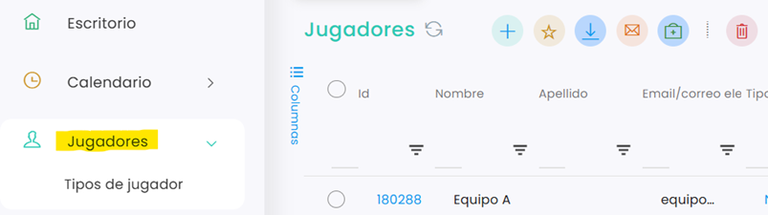

# Cómo restar saldo de un bono a un jugador

Uno de los principales usos que se dará al programa será la gestión de bonos de los jugadores. En este artículo detallaremos cómo restar saldo manualmente a un bono ya asignado a un jugador y los pasos a seguir.

### Video Explicativo



A continuación, se detallan los pasos a seguir:



### Acceso a Jugadores

* Accede al menú lateral izquierdo.
*   Haz clic en **Jugadores**. 

    <figure><figcaption></figcaption></figure>
* Busca al jugador al que quieres restarle saldo del bono.
* Haz clic sobre su id para abrirla.



### Acceso al bono del jugador

*   Dentro de la ficha del jugador, accede a la pestaña **Bonos**. 

    <figure><figcaption></figcaption></figure>
* En el apartado de **bonos activos**, localiza el bono sobre el que quieres hacer el ajuste.
* Haz clic sobre el id del bono correspondiente para abrir su detalle.
*   Una vez dentro, accede a la pestaña **Movimientos**. 

    <figure><figcaption></figcaption></figure>



### Restar saldo del bono

*   Dentro de **Movimientos**, haz clic en el botón **+** para añadir un nuevo movimiento. 

    <figure><figcaption></figcaption></figure>
* En la ventana emergente:
  * El campo **Balance**, se deja en blanco.
  * En el campo **Cantidad**, introduce el importe en **negativo** que quieras descontar del bono.
  * En **Observaciones**, añade una referencia para identificar el motivo del ajuste.
* Haz clic en **Guardar**.

> **Importante:** para descontar saldo, el valor debe introducirse en negativo. Por ejemplo: `-5`, `-10,50`, etc.



### Comprobación del ajuste

Una vez guardado el movimiento:

* Verás una nueva línea en el listado de **Movimientos**.
* En esa línea podrás comprobar:
  * la **cantidad descontada**,
  * la **cantidad previa**,
  * y el **nuevo balance** resultante.
* Si el ajuste se ha realizado correctamente, el saldo del bono quedará actualizado automáticamente.

<figure><figcaption></figcaption></figure>



Con estos pasos podrás descontar saldo de un bono de forma manual desde la ficha del jugador, manteniendo actualizado su balance y el historial de movimientos. Este ajuste te permitirá llevar un control más preciso de los bonos asignados y consultar fácilmente cualquier modificación realizada.
