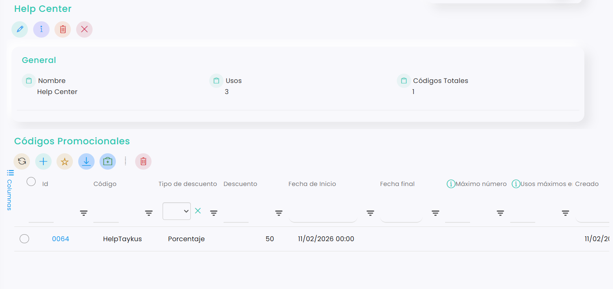

# Cómo editar un código promocional

Los códigos promocionales pueden modificarse en cualquier momento para ajustar descuentos, fechas o límites de uso según las necesidades de la campaña. Editarlos correctamente permite mantener el control de las promociones activas sin necesidad de crear códigos nuevos.

En este artículo te explicamos cómo editar un código promocional paso a paso.



### Acceso a Códigos promocionales

* Dirígete al menú lateral izquierdo y selecciona **Marketing.**
*   En el desplegable, haz clic en **Códigos Promocionales**, y directamente se redirigirá a la pestaña de **Promociones.** 

    <figure><figcaption></figcaption></figure>



### Selección de promoción

* Clica sobre el id del código que se quiere editar.
*   Nos redirige a esta sección que se muestra en la imagen: 

    <figure><figcaption></figcaption></figure>

    *   En la parte superior, dentro del apartado **General**, se muestra un resumen del estado de la promoción:

        * **Nombre:** nombre de la promoción. Puede editarse en cualquier momento.
        * **Usos:** número total de veces que el código ha sido utilizado.
        * **Códigos totales:** cantidad de códigos creados dentro de la promoción. En promociones simples normalmente será 1.

        En la parte inferior aparece el listado de **Códigos promocionales** asociados a la promoción.



### Editar código promocional

* Haz clic sobre el id del código.
*   Clica sobre <i class="fa-pen" style="color:green;">:pen:</i>

    <figure><figcaption></figcaption></figure>
* Edita los campos que necesites y clica Guardar para salvar los cambios.



Editar un código promocional permite adaptar campañas activas sin necesidad de crear promociones nuevas. Revisar periódicamente sus parámetros ayuda a mantener el control de descuentos y evitar errores en su aplicación.
