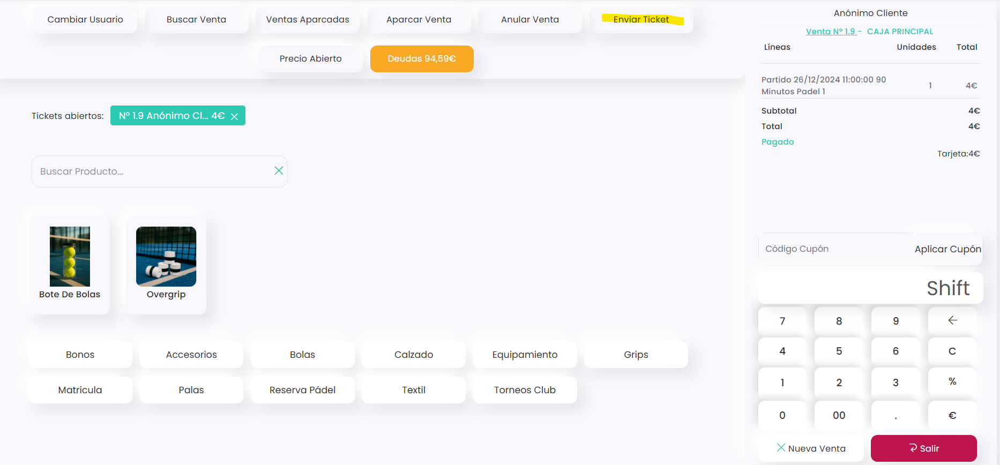

# Cómo enviar un ticket desde el TPV

La opción **Enviar ticket** en el TPV permite remitir el comprobante de venta al correo electrónico del jugador de forma rápida y sencilla. Tras realizar una venta, el sistema lo envía automáticamente a la dirección registrada en su ficha. Además, esta función permite reenviarlo manualmente desde el TPV y modificar el correo de destino si el cliente desea recibirlo en otra dirección.

En este artículo te mostramos cómo utilizar esta opción paso a paso.



### Localiza la venta

* Es posible localizar la venta desde el propio TPV, desde el calendario o desde **Líneas de venta**.
* Una vez localizada, ábrela en el TPV.



### Enviar ticket

*   Haz clic en **Enviar Ticket**. 

    <figure><figcaption></figcaption></figure>
*   El sistema mostrará una ventana emergente con los datos de la ficha del jugador.

    
<figure><figcaption></figcaption></figure>

* Desde aquí puedes editar la dirección de correo a la que se enviará el ticket.
* Pulsa **Ok** para completar el envío.



### Comprobación

* Dirígete al menú lateral izquierdo y selecciona Comunicaciones / Emails.

<figure><figcaption></figcaption></figure>

* Desde esta sección puedes visualizar el listado de correos enviados por el sistema.
*   Localiza el email correspondiente y verifica que en la columna **Estatus de envío** aparezca marcado como **Enviado**. 

    <figure><figcaption></figcaption></figure>



Reenviar el ticket desde el TPV permite asegurar que el jugador reciba su comprobante correctamente, incluso si es necesario modificar la dirección de correo. Verificar el estado del envío desde **Comunicaciones → Emails** confirma que el mensaje ha salido del sistema y garantiza el seguimiento adecuado de la operación.

