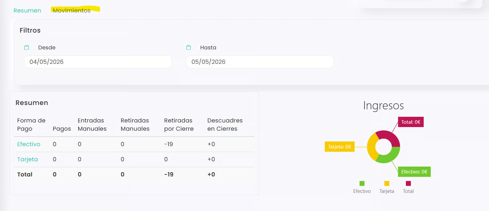

# Cajas



## Cómo abrir la caja

La sección de **Cajas** permite llevar un control de los ingresos registrados en el centro, consultar los movimientos realizados y revisar el resumen de las distintas formas de pago.

Desde este apartado también podremos **abrir una caja**, indicando los datos necesarios para comenzar a registrar movimientos correctamente durante la jornada.

### Video Explicativo

En este artículo veremos cómo acceder a la sección de **Ventas > Cajas** y cómo realizar la apertura de caja paso a paso.



### Acceso a cajas

* Dirígete a la columna de la izquierda y selecciona Ventas.
* Se abre un desplegable. Selecciona Cajas.\
  .png>)
*   Se accede al resumen de caja. Clica en la pestaña de **Movimientos.** 

    <figure><figcaption></figcaption></figure>



### Abrir caja

*   Clica en **Abrir.** 

    <figure><figcaption></figcaption></figure>
*   Se mostrará una ventana para confirmar la apertura de la caja principal.

    
<figure><figcaption></figcaption></figure>

* En esta ventana aparecerán los siguientes campos:
  * **Efectivo:** aquí deberás indicar el importe real de efectivo con el que se inicia la caja.
  * **Deberías tener:** debajo del campo de efectivo, el sistema mostrará el importe que debería haber en caja según el cierre anterior.\
    Este importe corresponde al efectivo que se dejó registrado al cerrar la caja el día anterior.
  * **Observaciones:** este campo permite añadir cualquier comentario o aclaración relacionada con la apertura de caja. Por ejemplo, si el efectivo real no coincide con el importe esperado.
  * **Cancelar:** permite cerrar la ventana sin abrir la caja.
  * **OK:** confirma la apertura de caja con los datos indicados.

> **Nota:** Si el importe indicado en “Deberías tener” no coincide con el efectivo real disponible en caja, revisa el importe antes de abrirla y añade una observación explicando la diferencia si fuera necesario.



Una vez completado el formulario y pulsado **OK**, la caja quedará abierta y se podrán comenzar a registrar movimientos asociados a ella.

Desde esta misma pantalla podrás consultar el resumen de formas de pago, la gráfica de ingresos, aplicar filtros por fecha y revisar los movimientos de caja siempre que sea necesario.



## Cómo hgacer un recuento de caja

El recuento de caja permite comprobar el dinero disponible en caja en un momento concreto, sin necesidad de cerrar la jornada.

Esta opción resulta útil para revisar si el efectivo real coincide con el importe que el sistema calcula que debería haber según los movimientos registrados. De esta forma, el club puede detectar posibles diferencias, revisar el estado de la caja y dejar constancia del recuento antes de continuar trabajando.

### Video Explicativo



### Acceso a Cajas

* Dirígete a la columna de la izquierda y selecciona Ventas.
* Se abre un desplegable. Selecciona Cajas.\
  
*   Se accede al resumen de caja. Clica en la pestaña de **Movimientos.** 

    <figure><figcaption></figcaption></figure>



### Realizar recuento

* Clica en **Recuento**.\
  .png>)
*   Este proceso no cierra la caja, sino que permite hacer una comprobación del efectivo existente en ese momento. 

    <figure><figcaption></figcaption></figure>

    *   **Efectivo**

        En el campo **Efectivo,** puedes indicar directamente el importe total de efectivo que hay en caja.

        Debajo del campo aparecerá el importe que el sistema calcula que deberías tener, según los movimientos registrados hasta ese momento.

        Esto permite comparar el importe real contado con el importe esperado por el sistema.
    *   **Recuento**

        También es posible completar el apartado **Recuento**, indicando la cantidad real de monedas y billetes disponibles en caja.

        Para ello, deberás introducir el número de unidades que tienes de cada importe: céntimos, monedas y billetes. El sistema realizará el cálculo automáticamente para obtener el total de efectivo.

        * El botón **Limpiar** permite borrar los importes introducidos en el recuento y comenzar de nuevo.
    *   **Tarjeta**

        En el campo **Tarjeta** se puede indicar el importe total cobrado con tarjeta durante la jornada.

        * Debajo del campo aparecerá el importe que el sistema calcula que **deberías tener** en pagos con tarjeta, según los movimientos registrados.
    *   **Observaciones**

        El campo **Observaciones** permite añadir cualquier aclaración relacionada con el cierre de caja, especialmente si hay diferencias entre los importes reales y los importes esperados por el sistema.
    *   **Confirmar recuento**

        Una vez revisados los datos, pulsa **OK** para confirmar el cierre de caja.

        Si no quieres cerrar la caja, puedes pulsar **Cancelar** o cerrar la ventana desde la **X** superior.



Una vez confirmado el recuento, el sistema guardará la información introducida sin cerrar la caja.

De esta forma, el club podrá consultar el estado real de la caja en ese momento, comprobar posibles diferencias entre el efectivo contado y el importe esperado, y mantener un mayor control sobre los movimientos registrados durante la jornada.



## Cómo hacer una entrada o retirada de efectivo

Las entradas y retiradas de efectivo permiten registrar movimientos manuales en caja no vinculados a ventas, como reposiciones de fondo o pagos menores. Cada operación queda reflejada en el cierre e informes, asegurando control y trazabilidad.

### Video Explicativo

A continuación, te explicamos el paso a paso:



### Acceso a Cajas

* Dirígete a la columna de la izquierda y selecciona Ventas.
* Se abre un desplegable. Selecciona Cajas.\
  .png>)
*   Se accede al resumen de caja. Clica en la pestaña de **Movimientos.** 

    <figure><figcaption></figcaption></figure>



### Entrada/ Retirada de efectivo

* Clica en Retirada/ Entrada de efectivo.\
  .png>)
* En ambas opciones se abre el siguiente formulario:\
  .png>)
* Completamos de la siguiente manera:
  * **Efectivo:** La cantidad de dinero en efectivo que se va a extraer/ introducir en la caja.
  * **Comentarios:** El concepto que justifica dicha retirada/ entrada.
* Pulsa OK para salvar la acción.



Con este procedimiento, el movimiento quedará registrado en la caja correspondiente y podrá consultarse posteriormente desde los movimientos de caja, el cierre y los informes disponibles. De esta forma, el club mantiene un control claro de las entradas y salidas manuales de efectivo, diferenciándolas de las ventas realizadas desde el sistema.

Antes de guardar la operación, es recomendable revisar que el importe y el comentario sean correctos, ya que esta información servirá para justificar el movimiento en caso de revisión interna.



## Cómo cerrar la caja

El cierre de caja permite finalizar la jornada de trabajo y dejar registrado el efectivo disponible al terminar el día.

Desde este proceso podremos indicar cuánto dinero queda en caja, revisar posibles diferencias y añadir observaciones si fuera necesario. Este dato será importante, ya que servirá como referencia para la próxima apertura de caja.

### Video Explicativo

En este artículo veremos cómo cerrar la caja desde **Ventas > Cajas** y qué información debemos completar antes de confirmar el cierre.



### Acceso a Cajas

* Dirígete a la columna de la izquierda y selecciona Ventas.
* Se abre un desplegable. Selecciona Cajas.\
  
*   Se accede al resumen de caja. Clica en la pestaña de **Movimientos.** 

    <figure><figcaption></figcaption></figure>



### Cerrar caja

* Clica en **Cerrar**.\
  .png>)
*   Al pulsar en **Cerrar**, se mostrará una ventana para registrar el cierre de la caja principal.

    En esta ventana podremos indicar el efectivo y los pagos con tarjeta registrados al finalizar la jornada. 

    <figure><figcaption></figcaption></figure>

    *   **Efectivo**

        En el campo **Efectivo** se puede indicar directamente el importe total de efectivo que hay en caja al cierre.

        Debajo del campo aparecerá el importe que el sistema calcula que **deberías tener**, según los movimientos registrados durante la jornada.
    *   **Recuento**

        También es posible completar el apartado **Recuento**, indicando la cantidad real de monedas y billetes disponibles en caja.

        Para ello, deberás introducir el número de unidades que tienes de cada importe: céntimos, monedas y billetes. El sistema realizará el cálculo automáticamente para obtener el total de efectivo.

        * El botón **Limpiar** permite borrar los importes introducidos en el recuento y comenzar de nuevo.
    *   **Cuánto quieres dejar**

        En el campo **Cuánto quieres dejar** se debe indicar el importe de efectivo que se quedará en caja para la siguiente jornada.

        * Este importe será el que aparecerá como referencia en la próxima apertura de caja, dentro del apartado **“Deberías tener”**.
    *   **Tarjeta**

        En el campo **Tarjeta** se puede indicar el importe total cobrado con tarjeta durante la jornada.

        * Debajo del campo aparecerá el importe que el sistema calcula que **deberías tener** en pagos con tarjeta, según los movimientos registrados.
    *   **Observaciones**

        El campo **Observaciones** permite añadir cualquier aclaración relacionada con el cierre de caja, especialmente si hay diferencias entre los importes reales y los importes esperados por el sistema.
    *   **Confirmar cierre**

        Una vez revisados los datos, pulsa **OK** para confirmar el cierre de caja.

        Si no quieres cerrar la caja, puedes pulsar **Cancelar** o cerrar la ventana desde la **X** superior.



Una vez completados los datos y pulsado **OK**, la caja quedará cerrada y el sistema guardará el efectivo indicado como importe final del día.

Este importe será el que aparecerá como referencia en la siguiente apertura de caja, dentro del apartado **“Deberías tener”**, permitiendo comprobar si el efectivo real coincide con lo registrado anteriormente.


