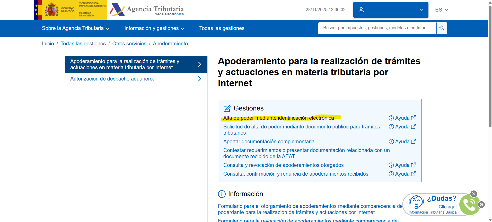
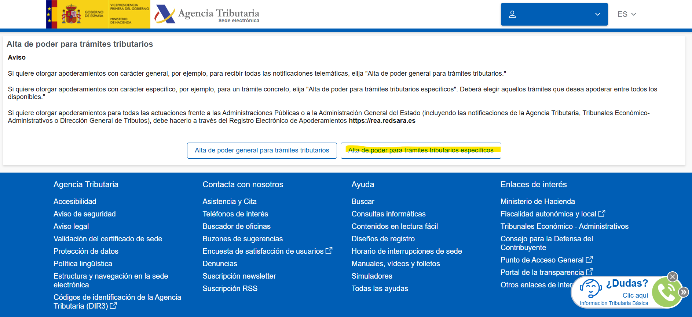
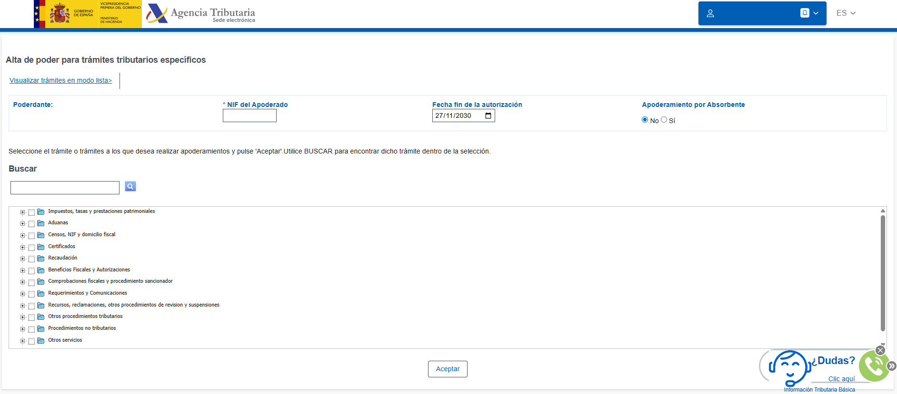
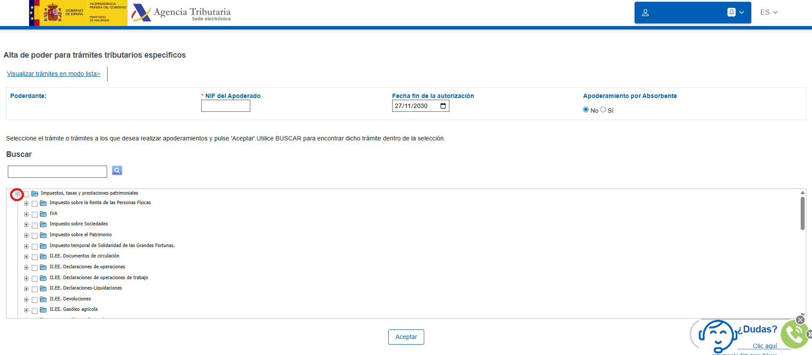
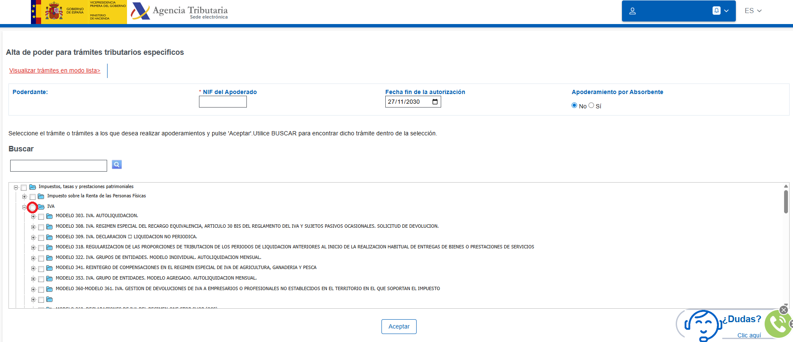
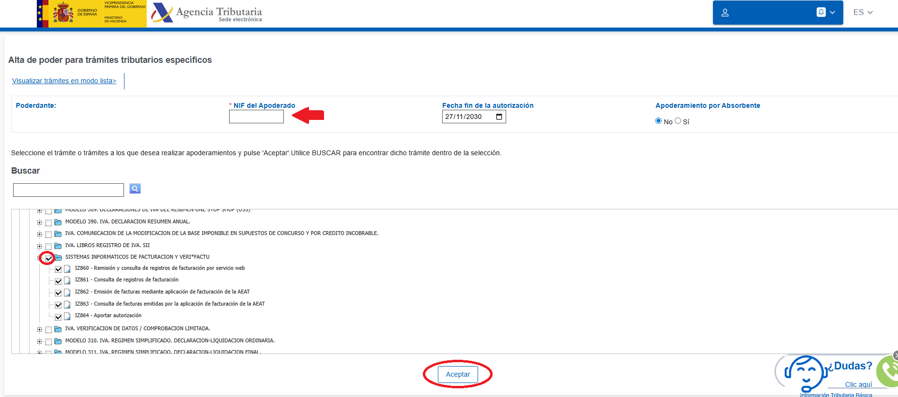

# Cómo autorizar a Taykus como software de envío de facturas para Veri\*FACTU

Autorizar a Taykus en la Agencia Tributaria es un paso obligatorio para que el sistema pueda enviar automáticamente las facturas a Ver&#x69;_&#x46;actu y cumplir con la normativa._ Es un proceso simple, pero imprescindible: sin esta autorización, las facturas no se podrán comunicar y el envío quedará bloqueado. En esta guía vas a ver, paso a paso, cómo completar la autorización desde la web de Hacienda y dejar tu cuenta lista para trabajar con VeriFactu sin complicaciones.



### Acceso a la sede Electrónica de la Agencia Tributaria

* Clica en el siguiente enlace para acceder.\
  [https://sede.agenciatributaria.gob.es/Sede/procedimientoini/ZP01.shtml](https://sede.agenciatributaria.gob.es/Sede/procedimientoini/ZP01.shtml)



### Identifícate

*   Puedes identificarte con **Cl@ve Móvil** o con **Certificado o DNI electrónico**. 

    <figure><figcaption></figcaption></figure>

    <figure><figcaption></figcaption></figure>



### Alta de poder mediante identificación electrónica

*   Clica en **Alta de poder mediante identificación electrónica.**

    <figure><figcaption></figcaption></figure>
*   En la siguiente pantalla clica en **Alta de poder para trámites tributarios específicos.** 

    <figure><figcaption></figcaption></figure>



### Alta de poder para trámites tributarios específicos

*   Al entrar con el certificado digital aparece esta pantalla del poderdante.

    <figure><figcaption></figcaption></figure>

*   Haz clic en el botón :heavy\_plus\_sign: **Impuestos, tasas y prestaciones patrimoniales.**

    <figure><figcaption></figcaption></figure>
* Se abre un desplegable.
*   Clica en el boton :heavy\_plus\_sign: **IVA.** 

    <figure><figcaption></figcaption></figure>

* Baja hasta encontrar :heavy\_plus\_sign: **Sistemas informáticos de facturación y veri\*factu.**
*   Selecciona todo. 

    <figure><figcaption></figcaption></figure>
* Una vez hecho, escribe el NIF del apoderado, es decir, el de Taykus - **B72652456.**
* Clica en Aceptar.


